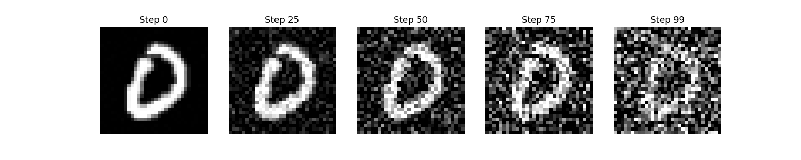
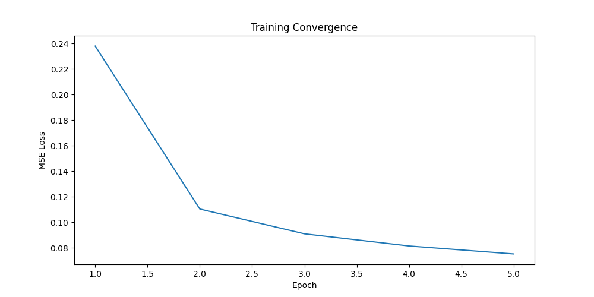
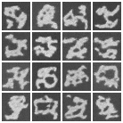
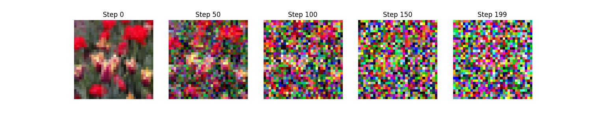
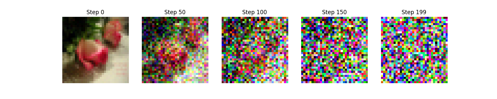
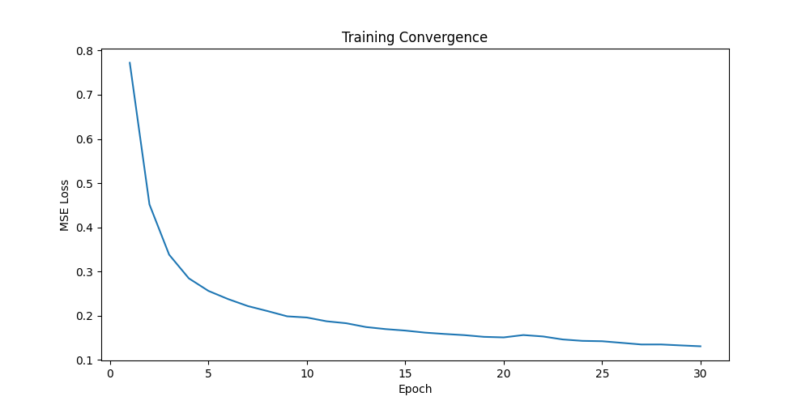
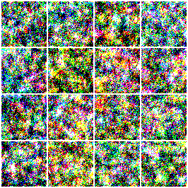

# Лабораторна робота №2: Базовий DDPM
**Виконав:** ст. гр. ІПЗм-25-2 Ханьжин М. А.  
**Тема:** Дослідження архітектури U-Net та стратегій зашумлення для генерації зображень

## 1. Опис проєкту
Цей репозиторій містить реалізацію дифузійної моделі (Denoising Diffusion Probabilistic Model) на базі архітектури U-Net. Проєкт реалізовано на мові Python з використанням фреймворку PyTorch. Архітектура має модульну структуру: `configs.py` для керування гіперпараметрами, `dataloader.py` для препроцесингу зображень, `unet.py` з описом шарів мережі та `diffusion.py`, що містить логіку дифузійних процесів.

### Технічні умови та апаратне забезпечення
Усі обчислювальні експерименти проводилися **виключно на локальних потужностях (GPU NVIDIA RTX 4060, 8GB VRAM)**. Використання хмарних середовищ (зокрема Google Colab) виявилося неефективним через значні часові витрати на навчання, нестабільність сесій та брак доступної відеопам'яті при роботі з кольоровими зображеннями 64x64. Локальне залізо дозволило стабільно задіяти технологію автоматичної змішаної точності (AMP) для оптимізації процесів.

---

## 2. Експеримент №1: MNIST (Задовільно)
Перший етап дослідження фокусувався на генерації монохромних рукописних цифр розміром 32х32.

* **Параметри:** 100 кроків дифузії, 3 рівні U-Net, 32 базових канали, без блоків Self-Attention.
* **Результат:** За 5 епох навчання MSE Loss знизився з 0.238 до **0.075**.

| Пряма дифузія |
| :---: |
|  |

| Динаміка навчання (Loss) | Результат генерації (Grid) |
| :---: | :---: |
|  |  |

---

## 3. Експеримент №2: Flowers (Добре)
Для складнішого датасету Flowers (64x64, RGB) архітектуру було розширено до 4 рівнів із 64 базовими каналами та додано механізм Self-Attention у bottleneck-шарі (8x8).

### Порівняння стратегій зашумлення (Beta Schedules)
Було проведено порівняльний аналіз **Linear** та **Cosine** schedules при 200 кроках дифузії. Експериментально підтверджено, що Cosine Schedule забезпечує більш плавний перехід, дозволяючи моделі довше зберігати структуру об'єкта під час навчання.

| Пряма дифузія (Linear) | Пряма дифузія (Cosine) |
| :---: | :---: |
|  |  |

### Фінальні результати (Cosine Schedule)
Використання косинусного графіка зміни параметрів зашумлення дозволило отримати найкращу збіжність моделі на складному датасеті Flowers. За 30 епох навчання фінальний показник MSE Loss склав **0.1387**, що є кращим результатом порівняно з лінійним шедулером.

| Графік Loss (Flowers) | Генерація (30 епох) |
| :---: | :---: |
|  |  |

---

## Висновки
В ході лабораторної роботи було доведено ефективність архітектури U-Net для генерації зображень методом дифузії. Встановлено, що для фотореалістичних даних (Flowers) використання **Cosine schedule** є більш ефективним, оскільки воно забезпечує вищу стабільність навчання та нижчу фінальну похибку MSE. Досягнуті результати підтверджують здатність моделі до вивчення складних розподілів даних та генерації нових зразків, що відповідають статистичним характеристикам навчальної вибірки.
